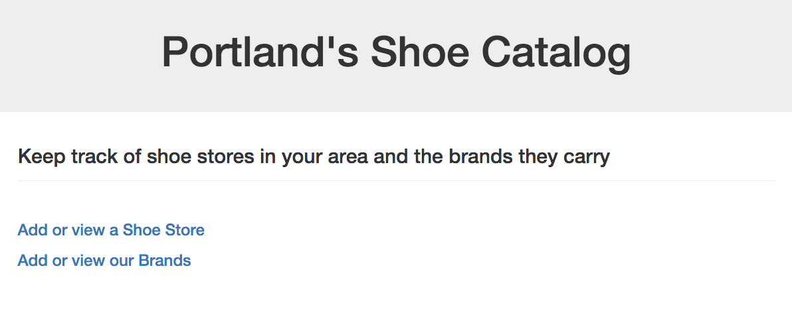

# Shoe Database Assessment

## Epicodus PHP, Week 4: Database practice. Many-to-many relationships

### By: Jordan Meier

### Description

This week's code review is a website where a user can go to add and view shoe stores in their and add/view brands that those stores carry.



### Known Bugs

* When editing store or brand names, the form does not like apostrophes.

### Setup

Clone this repo on to your desktop, make sure that you have Composer installed on your computer and then:
* navigate into the project folder.
* In your terminal, run the command:
```shell
composer install
```
* Once it is finished installing, navigate to the 'web' directory.
* In the 'web' directory, start the server with this command (if you are using a mac):
```shell
php -S localhost:8000
```
* Go to your browser and for the URL, type in: localhost:8000

* To access the database, in a separate terminal window, navigate to your project folder and enter:
```shell
apachectl start
```
followed by:
```shell
mysql.server start
mysql -uroot -uroot
```
* In a new window in your web browser, type in: localhost:8080/phpmyadmin

* Login and click on the import tab. Under choose file, choose the file from the project folder ending in .sql and click go.

* You can now access the shoes database!

* If sql file does not properly work, you can enter the following into your designated mySQL terminal:
```shell
CREATE DATABASE shoes;
USE shoes;
CREATE TABLE stores (id serial PRIMARY KEY, store_name VARCHAR(255), location VARCHAR (255));
CREATE TABLE brands (id serial PRIMARY KEY, name VARCHAR(255));
CREATE TABLE stores_brands (id serial PRIMARY KEY, store_id INT, brand_id INT);
```

### Technologies Used
* html
* CSS
* PHP
* Silex
* MySQL
* Apache
* Twig
* PHPUnit
* Bootstrap v3.3.6

###Copyright & Licensing

Copyright (c) 2015 **Jordan Meier**

*This software is licensed under the MIT license.*

Permission is hereby granted, free of charge, to any person obtaining a copy
of this software and associated documentation files (the "Software"), to deal
in the Software without restriction, including without limitation the rights
to use, copy, modify, merge, publish, distribute, sublicense, and/or sell
copies of the Software, and to permit persons to whom the Software is
furnished to do so, subject to the following conditions:

The above copyright notice and this permission notice shall be included in
all copies or substantial portions of the Software.

THE SOFTWARE IS PROVIDED "AS IS", WITHOUT WARRANTY OF ANY KIND, EXPRESS OR
IMPLIED, INCLUDING BUT NOT LIMITED TO THE WARRANTIES OF MERCHANTABILITY,
FITNESS FOR A PARTICULAR PURPOSE AND NONINFRINGEMENT. IN NO EVENT SHALL THE
AUTHORS OR COPYRIGHT HOLDERS BE LIABLE FOR ANY CLAIM, DAMAGES OR OTHER
LIABILITY, WHETHER IN AN ACTION OF CONTRACT, TORT OR OTHERWISE, ARISING FROM,
OUT OF OR IN CONNECTION WITH THE SOFTWARE OR THE USE OR OTHER DEALINGS IN
THE SOFTWARE.
